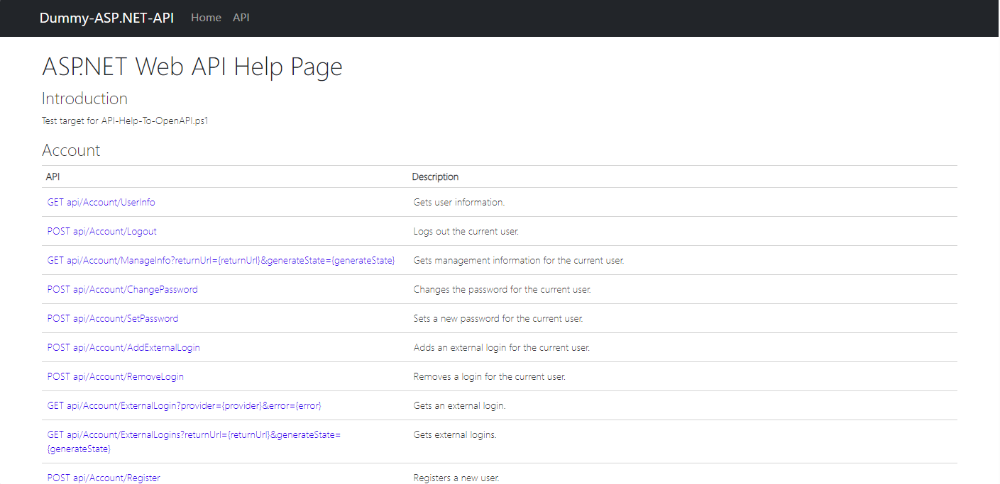
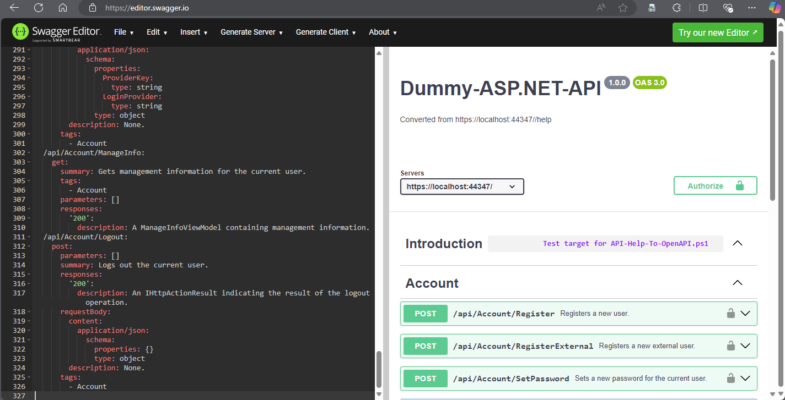

# API-Help-To-OpenAPI

This PowerShell script attempts to scrape the ASP.NET API Help pages into an OpenAPI format. It is used in scenarios where OpenAPI documentation has not been provided and aims to create a file compatible with assessment tools such as Postman or Burp Suite.

## Example

### Example ASP.NET API Help Page


### Scraped OpenAPI Specification (OAS)


## Parameters

- `OutputFilePath` (string): The file path where the generated OpenAPI JSON will be saved. Default is `./openapi.json`.
- `BaseUrl` (string): The base URL of the API help documentation. Default is `https://localhost:44347/`.

## Usage

1. Clone the repository.
2. Open a PowerShell terminal.
3. Run the script with the required parameters.

```powershell
.\API-Help-To-OpenAPI.ps1 -OutputFilePath "path\to\output\openapi.json" -BaseUrl "https://your-api-url/"